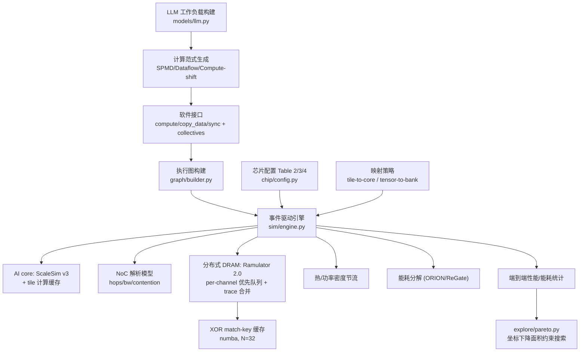

## 目标

实现一个名为 `voxelsim` 的 Python 包，复刻 [docs/voxel-simulator.md](docs/voxel-simulator.md) 描述的全部能力：软件接口、执行图、端到端事件驱动仿真、分布式 DRAM、trace 合并加速、热/能耗、Pareto 搜索；通过子进程集成真实组件级仿真器以对齐论文精度。

## 技术决策（已确认）

- 框架层：Python 3.10+ + NumPy，热点（trace 合并、XOR match key）用 `numba` JIT。
- AI core：集成真实 **ScaleSim v3**（`pip install scalesim`，GEMM 模式），按唯一 tile shape 缓存计算周期。
- DRAM：集成真实 **Ramulator 2.0**（C++ 构建，memory-trace 前端，subprocess + YAML 配置）。
- NoC 时序：自研解析模型（hop 数 / 带宽共享 / 争用）；**ORION 2.0** 仅在能耗阶段用于功率/面积。
- 验证：无 3D/IPU 硬件，采用自洽性测试 + 与组件仿真器交叉对拖。

## 架构总览

## 模块布局

- `voxelsim/api/`：`ops.py`（Tensor/TensorPart/OpTile）、`interface.py`（`compute`/`copy_data`/`sync`）、`collectives.py`（allReduce/reduceScatter/allGather/broadcast）、`program.py`（录制调用）
- `voxelsim/graph/`：`events.py`（Compute/CopyData/Sync 事件节点）、`builder.py`（依赖边构建）
- `voxelsim/chip/`：`config.py`（Table 2/3/4 默认值）、`topology.py`（mesh/torus/all-to-all + 路由/hop 计算）、`mapping.py`（sequential、dimension-ordered；uniform、interleave、software-aware）
- `voxelsim/sim/`：`engine.py`（按时间遍历）、`core_sim.py`、`noc_sim.py`、`dram_sim.py`（per-channel 优先队列）、`trace_coalesce.py`、`refresh.py`、`thermal.py`、`energy.py`
- `voxelsim/backends/`：`scalesim_backend.py`、`ramulator_backend.py`、`orion_backend.py`
- `voxelsim/models/`：`llm.py`（transformer prefill/decode 算子图）、`paradigms.py`
- `voxelsim/explore/pareto.py`、`voxelsim/cli.py`
- `third_party/`（克隆并构建 ramulator2、orion）、`configs/`（默认配置）、`tests/`

## 分阶段实现

### Phase 0 — 脚手架与配置

- `pyproject.toml`/`requirements.txt`（numpy、numba、scalesim、pyyaml、pandas、pytest）
- `chip/config.py`：用 dataclass 表达 Table 2/3/4 全部参数与默认值（compute-shift、dim-ordered、software-aware、2D mesh、12TB/s、256 cores、SA 32、group 8、32B/cycle、2MB SRAM、DRAM 8 层×16 bank、1.6GHz、tCL-tRCD-tRP-tRAS=14-14-14-34、0.7W/mm²、batch 32、seq 2048、128B 接口、BF16）

### Phase 1 — 软件接口 + 执行图（§4）

- `api/`：实现三个基础函数与复合集体通信；`Program` 记录事件序列
- `graph/builder.py`：节点=（core/bank/link 上的事件），有向边=数据依赖；保证仅靠 `compute()` 即可生成合法图

### Phase 2 — 硬件映射与 NoC 解析模型（§4.2）

- `chip/topology.py`：三种拓扑的相邻关系、路由、hop 数（torus wraparound、all-to-all=1 hop）
- `chip/mapping.py`：tile-to-core（sequential / dimension-ordered=MeshGEMM）、tensor-to-bank（uniform / interleave size-based / software-aware 并发检测）
- `sim/noc_sim.py`：基于传输量、可用带宽、hop、链路共享的争用模型；core-to-core 带宽 < SRAM 读带宽

### Phase 3 — 组件级后端集成（§5.3 / §5.5）

- `backends/scalesim_backend.py`：将 op tile 映射为 GEMM (m,n,k) topology，调用 ScaleSim v3，解析 `COMPUTE_REPORT.csv` 得到 cycles；按 tile shape 做 LRU 缓存
- `backends/ramulator_backend.py`：脚本化克隆+cmake 构建 `third_party/ramulator2`；生成 per-channel memory trace + YAML（注入 DRAM timing/组织），subprocess 运行并解析 latency 统计
- 提供降级桩：组件不可用时用解析公式占位，保证闭环可跑

### Phase 4 — 事件驱动引擎（§5.2 / §5.4 / §5.5）

- `sim/engine.py`：按时间顺序遍历，事件在依赖满足的最早时刻下发；`compute`→core，`copy_data`→NoC(+DRAM channel)
- `sim/dram_sim.py`：每 channel 按到达时间的优先级队列（同时间按 event index），request 拆成 burst
- 输出端到端 total/decode/prefill 时间与各项 overhead 分解

### Phase 5 — Trace 合并加速（§5.5）

- `sim/trace_coalesce.py`（numba）：对每 channel trace 计算相邻地址 XOR 得 match key；命中复用缓存延迟；mismatch 标记 divergent ± N（N=32）窗口，仅对 tagged 块跑 Ramulator，前 N 个 warm-up
- `sim/refresh.py`：跟踪 active refresh 地址区间，命中则推迟到 refresh 结束
- 目标：复现论文 ~99.91% 命中率量级的加速

### Phase 6 — 热 / 能耗 / 设计空间探索（§5.6 / §4.6 / §9.2）

- `sim/thermal.py`：按组件面积+并发功率算功率密度，超 0.7W/mm² 时按比例降频并延长事件
- `sim/energy.py`：AI core/DRAM/SRAM/NoC 动静态能耗分解（ORION 2.0 + ReGate 风格模型，面积模型 OpenRAM 等）
- `explore/pareto.py`：面积阈值离散 + 坐标下降最小化执行时间几何均值

### Phase 7 — LLM 工作负载 + 计算范式（§9.1 / §11）

- `models/llm.py`：参数化 transformer，构建 Llama2-13B / Gemma2-27B / OPT-30B / Llama3-70B / DiT-XL 的 prefill 与 decode 算子图
- `models/paradigms.py`：SPMD（独立 task+reduce）、Dataflow（microbatch pipeline + copy_data）、Compute-shift（ring circular shift）三种执行计划生成器

### Phase 8 — 验证与文档

- `tests/`：API/图/映射/拓扑单元测试；端到端 smoke（小模型小芯片）；trace 合并正确性（合并 vs 全量一致）
- 自洽性检查：复现论文趋势（如 compute-shift 优于 SPMD、software-aware 降低 row-conflict、core group 提升）
- `README.md` 使用说明 + CLI 示例；与 `docs/voxel-simulator.md` 章节对应表

## 主要风险

- ScaleSim/Ramulator/ORION 的构建与网络拉取（已确认环境可装 C++ 依赖；提供降级桩兜底）
- Python 事件循环在百万级事件下的性能 → 依赖 tile 计算复用 + trace 合并 + numba 热点加速
- 将 transformer 算子准确映射到 ScaleSim GEMM 与 Ramulator 地址布局，需在 Phase 3/7 对齐
- 无真实硬件，精度只能做自洽与组件对拖，不能完全复现论文 6.8% 误差结论

## 建议默认（除非你另行指定）

- 包名 `voxelsim`；Python 3.10+；测试用 pytest
- 第三方仿真器置于 `third_party/` 并提供 `scripts/setup_backends.sh` 一键构建
- 默认配置文件放 `configs/default.yaml`，对应 Table 2/3

