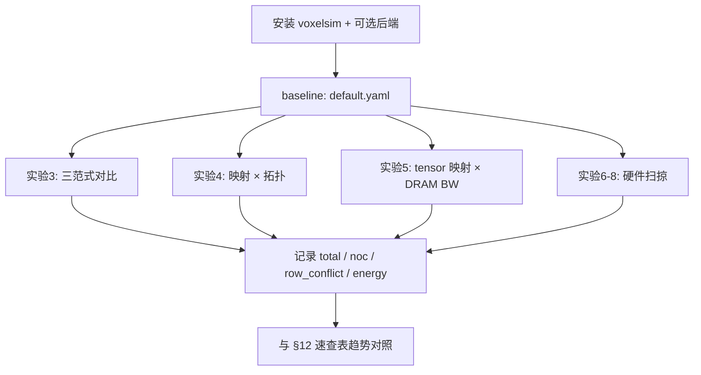

# Voxel 论文实验复现指南

> 面向本仓库 **voxelsim** 仿真器，梳理论文  
> *Exploring the Efficiency of 3D-Stacked AI Chip Architecture for LLM Inference with Voxel*  
> (Liu et al., arXiv:2604.26821v1, 2026)  
> 中的**实验流程、参数扫掠与主要结果**，并给出可执行的复现步骤。
>
> 技术背景见 [voxel-simulator.md](voxel-simulator.md)；安装与后端构建见 [README.zh-CN.md](../README.zh-CN.md)。

---

## 1. 实验总览

### 1.1 论文要回答的问题

论文用 Voxel 对 3D 堆叠 AI 芯片做**软硬件协同设计空间探索（DSE）**，核心变量包括：

| 类别 | 变量 | 论文默认（Table 2） |
|------|------|---------------------|
| 软件 | 计算范式 | compute-shift |
| 软件 | Tile-to-core 映射 | dimension-ordered |
| 软件 | Tensor-to-bank 映射 | software-aware |
| 硬件 | NoC 拓扑 | 2D mesh |
| 硬件 | DRAM 总带宽 | 12 TB/s |
| 硬件 | Core 数 | 256 |
| 硬件 | Systolic array | 32×32 |
| 硬件 | Core group 大小 | 8 |
| 硬件 | NoC link 带宽 | 32 B/cycle |
| 硬件 | 每 core SRAM | 2048 KB |

其他固定参数见 Table 3（batch=32、seq_len=2048、BF16、1.6 GHz、功率密度上限 0.7 W/mm² 等）。

### 1.2 评估工作负载

| 模型 | 论文用途 | voxelsim CLI `--model` |
|------|----------|-------------------------|
| Llama2-13B [56] | LLM prefill / decode | `llama2-13b` |
| Gemma2-27B [55] | LLM prefill / decode | `gemma2-27b` |
| OPT-30B [67] | LLM prefill / decode | `opt-30b` |
| Llama3-70B [36] | LLM prefill / decode | `llama3-70b` |
| DiT-XL [47] | 视觉 Transformer，100 iterations | `dit-xl` |

**阶段定义：**

- **Prefill**：处理完整 prompt（`--stage prefill`，默认 seq_len=2048）
- **Decode**：单 token 生成（`--stage decode`，m=batch×1）

### 1.3 论文 Baseline 芯片配置

- **面积约束**：850 mm² / die（Table 4 合计约 802.6 mm²）
- **设计取向**：优先优化 **decode**（memory-bound，3D 芯片主战场）
- **DRAM**：12 TB/s 高带宽；对 prefill 不在 Pareto 最优曲线上（Figure 7）

默认配置已写入 [`configs/default.yaml`](../configs/default.yaml)。

### 1.4 论文实验章节与图表对照

| 论文章节 | 图表 | 实验内容 |
|----------|------|----------|
| §3.5 | Figure 6 | IPU emulator 交叉验证 |
| §4 intro | Figure 7 | Pareto area–performance 前沿 |
| §4.1 | Figure 8, 9 | SPMD / Dataflow / Compute-shift |
| §4.2 | Figure 10, 14(a) | 映射策略 × NoC 拓扑；NoC 带宽扫掠 |
| §4.3 | Figure 11, 12, 14(b) | Tensor-to-bank 策略；DRAM 带宽扫掠 |
| §4.4 | Figure 14(c)(d), 15, 16 | SA 尺寸、core 数、core group |
| §4.5 | Figure 14(e) | 每 core SRAM 容量 |
| §4.6 | Figure 17, 18 | DRAM 带宽 / core 数的能效 |

---

## 2. 复现环境准备

```bash
cd /path/to/wafer3d
python3 -m venv .venv && source .venv/bin/activate
pip install -e ".[dev]"

# 可选：构建 SCALE-Sim / Ramulator / BookSim / DSENT
bash scripts/setup_backends.sh
pip install -e third_party/SCALE-Sim   # 若未跑 setup 脚本
```

**建议后端：**

| 组件 | 论文工具 | voxelsim 路径 | 缺失时行为 |
|------|----------|---------------|------------|
| AI Core | SCALE-Sim v3 | `third_party/SCALE-Sim` | 解析 SA 模型 |
| DRAM | Ramulator 2.0 | `third_party/ramulator2/build/ramulator2` | 解析 row-buffer 模型 |
| NoC (Tier-B) | BookSim 2.0 | `third_party/booksim2/src/booksim` | Tier-A 解析 NoC |
| NoC 能耗 | DSENT | `third_party/dsent_standalone/dsent` | 解析能耗估计 |

---

## 3. 基线单次仿真（Table 2 默认点）

```bash
# Prefill，默认 compute-shift + mesh + software-aware（单层 smoke）
python -m voxelsim.cli --model llama2-13b --stage prefill

# Decode（cycle/token 语义：单 token）
python -m voxelsim.cli --model llama2-13b --stage decode

# 使用 BookSim NoC
python -m voxelsim.cli --model llama2-13b --stage prefill --noc-backend booksim
```

**输出 JSON 字段与论文指标对应：**

| JSON 字段 | 论文含义 |
|-----------|----------|
| `total_cycles` | 端到端 wall-clock cycles |
| `noc_overhead_cycles` | NoC 通信开销（Figure 9/10 深色部分） |
| `row_conflict_overhead_cycles` | DRAM row-buffer conflict 开销（Figure 11） |
| `dram_access_cycles` | DRAM 访问相关 cycles |
| `energy_joules` / `energy_breakdown` | §4.6 能耗分解（Figure 17/18） |

> **注意**：CLI 虽有 `--layers` 参数，但当前仍通过 `build_program_for_paradigm` 构建**单层**执行图（快速 smoke）。全层复现请用 Python 调用 `build_full_model_program(..., layers=N)`（见 §13.2）。

---

## 4. 实验一：仿真器验证（§3.5, Figure 6）

### 4.1 实验目的

在无商用 3D AI 芯片条件下，用 **Graphcore IPU Mk2 emulator** 验证 Voxel 端到端时序。

### 4.2 实验设置

| 项目 | 配置 |
|------|------|
| Emulator | IPU Mk2：1472 cores，960 作 AI core，512 模拟 DRAM bank |
| 对比曲线 | Emulated Time；Emulated Time + DRAM latencies；Simulated Time |
| 模型 | Llama2-13B, Gemma2-27B, OPT-30B, Llama3-70B, DiT-XL |
| DRAM 延迟 | 抽取重复 transformer block 的 trace，Ramulator 2.0 全精度仿真（**不用** trace coalesce） |

### 4.3 论文结果

- Emulator（SRAM 模拟 DRAM）平均比 Voxel **快 12.7%**（SRAM 任意模式满带宽）
- 加入 DRAM 延迟 replay 后，与 Voxel 总时间与 DRAM 分解高度吻合
- **误差：0.24% – 6.8%**

### 4.4 voxelsim 复现说明

| 状态 | 说明 |
|------|------|
| ⚠️ 部分支持 | 本仓库未集成 IPU emulator；可对比 Ramulator 后端 vs 解析 DRAM 的差异 |
| ✅ 可验证 | SCALE-Sim / Ramulator / trace coalesce 单元测试与后端集成测试 |

```bash
pytest tests/test_ramulator_backend.py tests/test_scalesim_backend.py tests/test_trace_coalesce.py -q
```

---

## 5. 实验二：Pareto 面积–性能前沿（Figure 7）

### 5.1 实验流程

1. 将面积约束离散为多个阈值（≤ 850 mm²）
2. 每个阈值下对硬件旋钮做 **coordinate descent**
3. 目标：最小化 prefill / decode **执行时间几何平均**
4. 输出 Pareto-optimal 配置集合

### 5.2 扫掠旋钮（论文 + voxelsim 实现）

| 旋钮 | 论文范围（Figure 14） | `ParetoExplorer` 候选值 |
|------|----------------------|---------------------------|
| DRAM 带宽 | 4–20 TB/s | 4, 8, 12, 16 TB/s |
| Core 数 | 64–1024 | 64, 128, 256, 512 |
| SA 尺寸 | 16–128 | 16, 32, 64 |
| SRAM | 0.5–16 MB | 512 KB, 2048 KB, 8192 KB |

### 5.3 复现命令

```bash
python -m voxelsim.cli --pareto --model llama2-13b
```

或在 Python 中：

```python
from voxelsim.chip.config import default_config
from voxelsim.models.llm import LLAMA2_13B
from voxelsim.models.paradigms import build_program_for_paradigm
from voxelsim.explore.pareto import ParetoExplorer

cfg = default_config()
prog = build_program_for_paradigm(cfg, LLAMA2_13B, stage="decode")
graph = prog.build_graph(cfg.num_cores)
frontier = ParetoExplorer(cfg).pareto_frontier(graph)
```

### 5.4 论文结论

- Baseline（★）在 850 mm² 内偏向 **decode 性能**
- 12 TB/s DRAM 点对 prefill 非 Pareto 最优

---

## 6. 实验三：计算范式（§4.1, Figure 8–9）

### 6.1 实验设计

固定 Table 2 默认硬件，仅改变**计算范式**：

| 范式 | 特征 | 配置值 |
|------|------|--------|
| SPMD | 分 task + 独立 reduction | `computation_paradigm: spmd` |
| Dataflow | 少 core 跑单算子，microbatch 流水线 | `computation_paradigm: dataflow` |
| Compute-shift | 全 chip 单算子，ring 上 circular shift | `computation_paradigm: compute_shift` |

### 6.2 复现步骤

复制 [`configs/default.yaml`](../configs/default.yaml) 为三份，仅改 `software.computation_paradigm`，分别运行五个模型的 prefill 与 decode：

```bash
for p in spmd dataflow compute_shift; do
  for m in llama2-13b gemma2-27b opt-30b llama3-70b; do
    for s in prefill decode; do
      python -m voxelsim.cli --config configs/exp_paradigm_${p}.yaml \
        --model $m --stage $s
    done
  done
done
```

记录 `total_cycles` 与 `noc_overhead_cycles`；NoC 占比 ≈ `noc_overhead_cycles / total_cycles`。

### 6.3 论文主要结果（Figure 9）

| 对比 | Prefill | Decode |
|------|---------|--------|
| SPMD NoC 占比 | 最高 **49.08%** | 较高 |
| Dataflow vs SPMD | 平均快 **35.70%** | — |
| Compute-shift vs SPMD | 平均快 **46.73%** | — |
| Compute-shift vs Dataflow | 平均快 **17.74%** | — |
| 范式间最大差距 | 最高 **1.84×** | — |

**Takeaway A1–A3：** 高效范式应最大化 compute / NoC / DRAM 重叠；**compute-shift 最优**。

---

## 7. 实验四：NoC 与 Tile 映射（§4.2, Figure 10, 14a）

### 7.1 实验设计

二维扫掠：

| 维度 | 取值 |
|------|------|
| Tile-to-core 映射 | `sequential` vs `dimension_ordered` |
| NoC 拓扑 | `mesh_2d`, `torus_2d`, `all_to_all` |

额外扫掠（Figure 14a）：NoC link 带宽 **4–32 B/cycle**（默认 32）。

### 7.2 复现配置示例

```yaml
# configs/exp_noc_mesh_dim.yaml
software:
  tile_to_core_mapping: dimension_ordered
hardware:
  noc_topology: mesh_2d
  noc_link_bandwidth_bytes_per_cycle: 32
```

```bash
python -m voxelsim.cli --config configs/exp_noc_mesh_dim.yaml \
  --model llama2-13b --stage prefill --noc-backend booksim
```

### 7.3 论文主要结果

| 发现 | 数值 |
|------|------|
| Dimension-ordered vs sequential（prefill，mesh） | 平均快 **46%** |
| Dimension-ordered（prefill，torus） | 平均快 **37%** |
| All-to-all 下映射策略 | **无影响**（均 1 hop） |
| Mesh + dim-ordered | 近最优且面积开销最低 |
| NoC-bound 工作负载最大收益 | 延迟降 **57.48%** |
| Decode 对 NoC 带宽 | **不敏感** |
| Prefill 在 link BW < **32 B/cycle** | 性能下降 |

**Takeaway B1–B3**

---

## 8. 实验五：DRAM 带宽与 Tensor 映射（§4.3, Figure 11–12, 14b）

### 8.1 实验设计

**Figure 11（decode，Llama2-13B）：** 扫 DRAM 带宽 4–16 TB/s × 三种 tensor 放置：

| 策略 | 配置值 | 说明 |
|------|--------|------|
| Uniform | `uniform` | 每 tensor 均匀切分到所有 bank |
| Interleave + size heuristic | `interleave_size` | 连续分配 tensor 轮转不同 bank |
| Software-aware | `software_aware` | 从执行图检测并发访问（论文提出） |

**Figure 12：** Uniform vs software-aware，prefill + decode 全模型。

**Figure 14(b)：** DRAM 带宽 4–20 TB/s，五模型 decode/prefill。

### 8.2 复现示例

```yaml
# configs/exp_dram_12tb_sw.yaml
software:
  tensor_to_bank_mapping: software_aware
hardware:
  dram_bandwidth_tbps: 12.0
```

```bash
# 需已构建 Ramulator 以获得精确 row-conflict 分解
python -m voxelsim.cli --config configs/exp_dram_12tb_sw.yaml \
  --model llama2-13b --stage decode
```

关注 `row_conflict_overhead_cycles` 与 `dram_access_cycles`。

### 8.3 论文主要结果

| 发现 | 数值 |
|------|------|
| 带宽增至 16 TB/s，uniform 下 conflict 占比 | 最高 **43.35%** |
| 带宽收益 plateau | 约 **10 TB/s**（uniform） |
| Software-aware conflict 占比（高带宽） | ≤ **14.8%** |
| Software-aware vs uniform conflict 降低 | 平均 **80.68%**（最高 80.7%） |
| Prefill 对 DRAM 带宽 | **相对不敏感**（compute-bound） |
| Decode 随带宽扩展 | **持续受益**（placement 正确时） |

**Takeaway C1–C2**

---

## 9. 实验六：Core / SA 扩展与 Core Group（§4.4, Figure 14c/d, 15–16）

### 9.1 实验设计

**公平比较约束：** 各配置保持**相同峰值 FLOPS 与总 SRAM**（Figure 15/16 横轴 `cores / SA size`）。

| 扫掠 | Figure | 范围 |
|------|--------|------|
| SA 尺寸 | 14(c) | 16–128（默认 32 最优） |
| Core 数 | 14(d) | 64–1024 |
| Core group 大小 | 16 | 1, 2, 4, 8, 16 |

Core group 机制（Figure 13）：组内 **request tracker** 同步 DRAM 请求，避免 execution desync 导致 row thrashing。

### 9.2 复现配置

```yaml
hardware:
  num_cores: 256          # 或 512, 1024（需 perfect square）
  systolic_array_size: 32
  core_group_size: 8      # 扫 1, 2, 4, 8, 16
```

### 9.3 论文主要结果

| 发现 | 数值 |
|------|------|
| SA > 32×32 | 收益递减（spatial underutilization） |
| 单纯增加 core 数 | DRAM 带宽利用率下降 |
| Core group=8，1024 cores decode | 比 group=1 最多快 **57%**（平均 **42%**） |
| Group > 8 | 额外收益可忽略 |

**Takeaway D1–D2**

### 9.4 voxelsim 复现差距

| 状态 | 说明 |
|------|------|
| ✅ | `num_cores`、`systolic_array_size` 扫掠 |
| ⚠️ | `core_group_size` 已在配置中，**request tracker 同步逻辑尚未接入仿真引擎**；暂无法复现 Figure 16 的 group 收益 |

---

## 10. 实验七：SRAM 容量（§4.5, Figure 14e）

### 10.1 实验设计

扫掠 `per_core_sram_kb`：**512 KB – 16 MB**（论文横轴 0.5–16 MB）。

```yaml
hardware:
  per_core_sram_kb: 512   # 扫 512, 2048, 8192, 16384
```

### 10.2 论文主要结果

| 工作负载 | 发现 |
|----------|------|
| Decode（memory-bound） | 更大 SRAM → 更大预取窗口；**8 MB/core** 可饱和 DRAM 带宽 |
| Prefill（compute-bound） | SRAM **32×** 仅提升 **35.7%**；0.5 MB 时 SA 利用率已 **67%** |

**Takeaway E1–E2**

---

## 11. 实验八：能效（§4.6, Figure 17–18）

### 11.1 实验设计

独立扫掠：

1. **DRAM 带宽** 4–20 TB/s（decode + prefill 能耗）
2. **Core 数** 64–1024

能耗分解组件（Figure 18）：DRAM / TSV / NoC / SRAM / VU / SA 的动静态能耗。

### 11.2 复现

```bash
python -m voxelsim.cli --model llama3-70b --stage decode
# 查看 energy_joules 与 energy_breakdown
```

Python 扫掠示例：

```python
for bw in [4, 8, 12, 16, 20]:
    cfg = ChipConfig.from_yaml("configs/default.yaml")
    cfg.dram_bandwidth_tbps = float(bw)
    stats = SimulationEngine(cfg).run(graph)
    print(bw, stats.energy_joules, stats.breakdown)
```

### 11.3 论文主要结果（Llama3-70B 为代表）

| 扫掠 | Decode | Prefill |
|------|--------|---------|
| ↑ DRAM 带宽 | 能效提升（执行时间大幅缩短，TSV 静态开销小） | 几乎不变 |
| ↑ Core 数 | 过多 core 反而降低能效 | 收益有限；512→1024 静态功耗翻倍但延迟仅降 32% |

**Takeaway F1–F2**

---

## 12. 论文结论速查表

| ID | 结论摘要 |
|----|----------|
| A1 | 计算范式性能差最高 **1.84×** |
| A2 | 应最大化 compute / NoC / DRAM 重叠；**compute-shift 最优** |
| A3 | SPMD reduction 导致 NoC 占 **49.08%** |
| B1 | Dimension-ordered 映射最多降延迟 **57.48%**（NoC-bound） |
| B2 | 高效映射下 mesh/torus/all-to-all 开销均低 |
| B3 | **Mesh + dimension-ordered** 为面积最优近优解 |
| C1 | 高带宽下 row conflict 可达 **43.35%**（uniform） |
| C2 | Software-aware 映射平均降 conflict **80.68%** |
| D1 | 单纯加 core 加剧 conflict、降低 DRAM 利用率 |
| D2 | Core group=8 对 1024-core decode 最多 **+57%** |
| E1 | Decode：8 MB SRAM/core 饱和 DRAM 带宽 |
| E2 | Prefill：SRAM 32× 仅 **+35.7%** |
| F1 | 扩 DRAM 带宽改善 decode 能效 |
| F2 | 过多 core 损害整体能效 |

---

## 13. 推荐复现工作流



### 13.1 最小趋势复现（约 30 分钟）

1. 三范式 × 1 模型 × prefill：`spmd` / `dataflow` / `compute_shift`
2. 验证 compute-shift 的 `noc_overhead_cycles` 最低
3. `tensor_to_bank_mapping: uniform` vs `software_aware`，观察 `row_conflict_overhead_cycles`

### 13.2 全层仿真示例（Python）

```python
from voxelsim.chip.config import default_config
from voxelsim.models.llm import LLAMA2_13B, build_full_model_program
from voxelsim.sim.engine import SimulationEngine

cfg = default_config()
prog = build_full_model_program(
    LLAMA2_13B,
    seq_len=cfg.sequence_length,
    batch=cfg.batch_size,
    stage="decode",
    layers=LLAMA2_13B.num_layers,  # 40
    num_cores=cfg.num_cores,
)
graph = prog.build_graph(cfg.num_cores)
stats = SimulationEngine(cfg).run(graph)
print(stats.total_cycles, stats.noc_overhead_cycles)
```

### 13.3 论文级完整复现（待完善项）

| 项目 | 状态 |
|------|------|
| 五模型 × 两阶段 × 全层数 | 需 `build_full_model_program(layers=40/80…)`，运行时间长 |
| Figure 6 IPU 验证 | 需外部 emulator，未内置 |
| Core group request tracker | 配置已有，引擎待实现 |
| Figure 14 全网格扫掠 | 需批量脚本（可自行 loop YAML） |
| DiT-XL 100 iterations | CLI 需扩展 iteration 参数 |

---

## 14. 配置模板目录建议

可在 `configs/experiments/` 下维护（需自行创建）：

```
configs/experiments/
  baseline.yaml              # 等同 default.yaml
  paradigm_spmd.yaml
  paradigm_dataflow.yaml
  paradigm_compute_shift.yaml
  noc_mesh_dim.yaml
  noc_torus_seq.yaml
  dram_uniform_4tb.yaml
  dram_swaware_16tb.yaml
  sram_512kb.yaml
  sram_8192kb.yaml
```

[`configs/default.yaml`](../configs/default.yaml) 中关键字段与论文 Table 2/3 **已对齐**，作为所有实验的参考起点。

---

## 16. 复现报告

运行批量实验并生成论文对照报告：

```bash
python scripts/run_reproduction.py --quick
# 完整 Table 2/3 规模（耗时数小时）：
python scripts/run_reproduction.py --full
```

输出：

- [`docs/voxel-reproduction-report.md`](voxel-reproduction-report.md) — PASS/PARTIAL/FAIL 趋势核对
- [`docs/reproduction-results.json`](reproduction-results.json) — 原始 JSON 数据

---

## 15. 参考文献

- 论文：arXiv:2604.26821v1
- 本地 PDF：`/home/luke/wiki/raw/papers/Exploring the efficiency of 3D-stacked AI chip architecture for LLM inference with voxel.pdf`
- 仿真器技术细节：[voxel-simulator.md](voxel-simulator.md)
